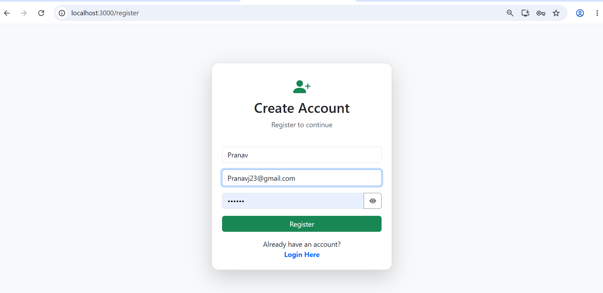
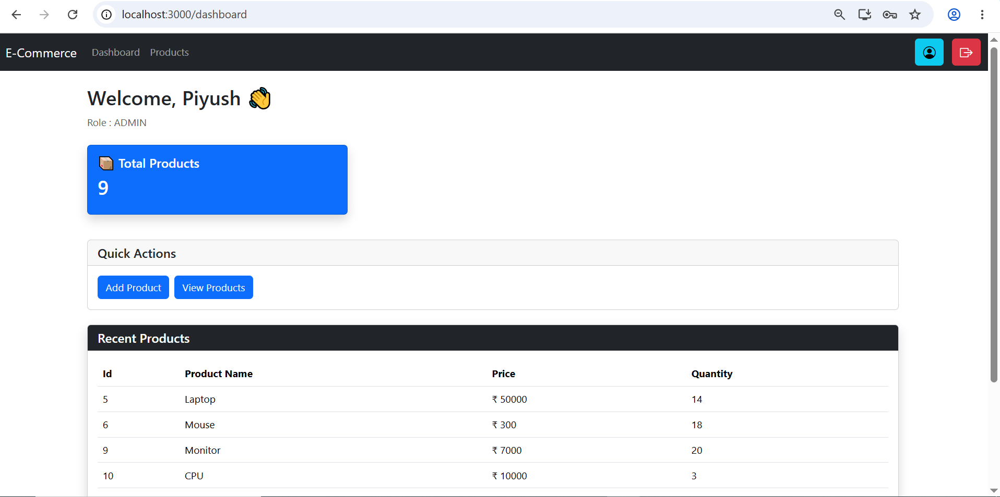
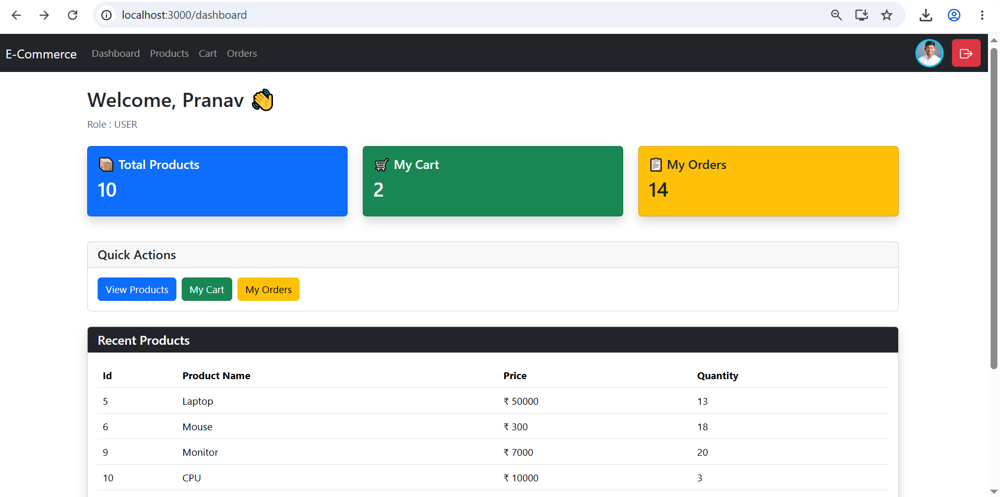
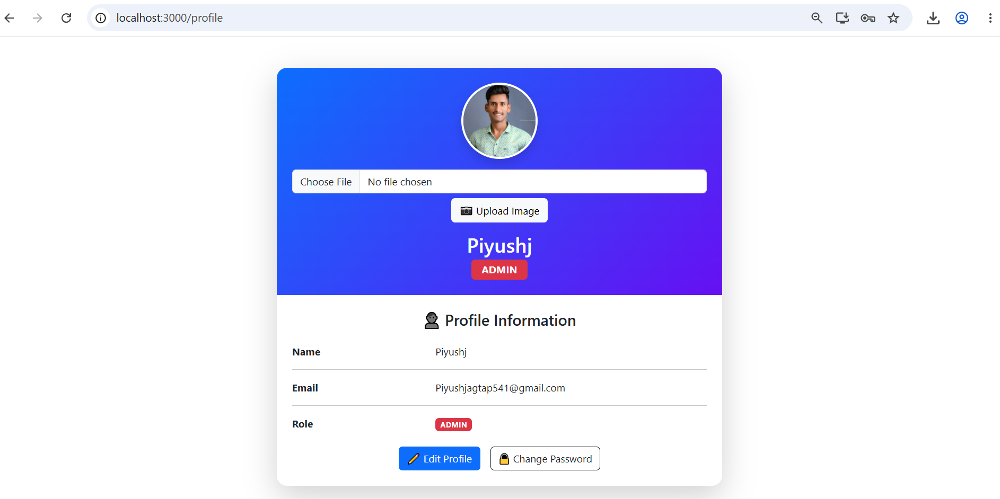
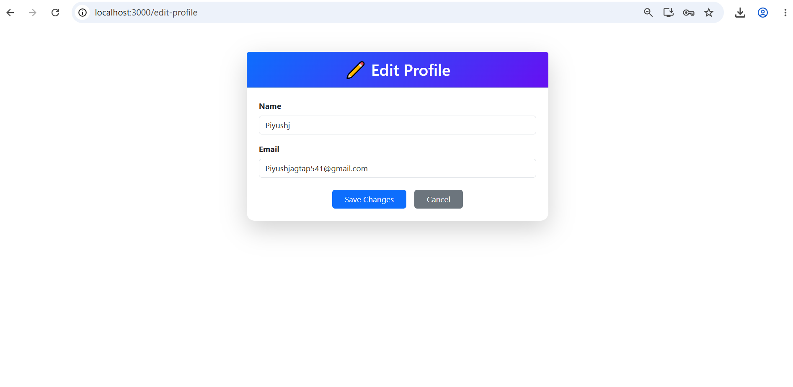
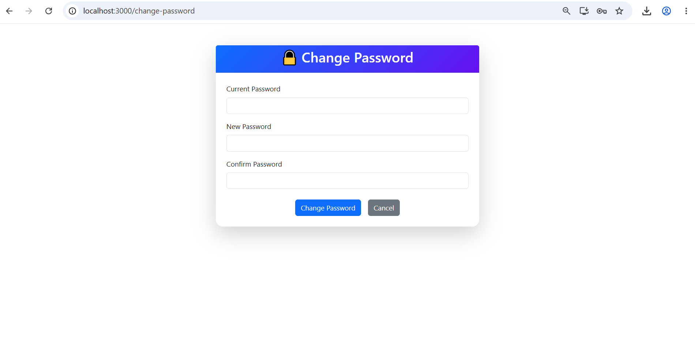

# E-Commerce Management System

A full-stack E-Commerce Management System built using Spring Boot, React.js, MySQL, JWT Authentication, and Role-Based Access Control (RBAC). The application provides secure authentication, product management, cart functionality, and order management for both Admin and User roles.

---

## Features

### Authentication & Security

- User Registration and Login
- JWT Token-Based Authentication
- Spring Security Integration
- Role-Based Access Control (ADMIN / USER)
- Protected API Endpoints


### REST API Features

- Authentication APIs
- Product Management APIs
- Cart Management APIs
- Order Management APIs
- Role-Based Authorization


### Admin Features

- Admin Dashboard
- Admin Profile Management
- View Profile
- Edit Profile
- Change Password
- Upload Profile Image
- View All Products
- Add New Products
- Update Existing Products
- Product Image Upload
- Delete Products
- Manage Product Catalog

### User Features

- User Dashboard
- User Profile Management
- View Profile
- Edit Profile
- Change Password
- Upload Profile Image
- Browse Products
- Add Products to Cart
- Buy Now
- View Cart Items
- Place Orders
- View Order History
- View Order Details

---

## Tech Stack

### Backend

- Java
- Spring Boot
- Spring Security
- JWT Authentication
- Spring Data JPA
- Hibernate
- MySQL

### Frontend

- React.js
- React Router
- Axios
- Bootstrap

### Tools & Platforms

- Git
- GitHub
- Postman
- VS Code
- Eclipse

---
## Database Tables
- **User** - Stores user account details, authentication data, and roles (ADMIN/USER)
- **Product** - Stores product information such as name, description, price, and stock
- **Category** - Stores product categories for better organization
- **Cart** - Stores products added to a user's shopping cart
- **Order** - Stores order details placed by users
- **OrderItem** - Stores individual products associated with each order

---
## Project Structure

E-Commerce-Management-System

│

├── backend

├── frontend

├── screenshots

└── README.md

---

## Screenshots

### Registration Page



### Login Page


### Admin Module

### Admin Dashboard



### Product List


### Add Product


### Update Product


---


### User Module

### User Dashboard



### Product List


### Cart


### My Orders


### Order Details View


---

## Profile Management

### Profile Page


### Edit Profile


### Change Password



---

## Installation & Setup

### Prerequisites

- Java 21
- MySQL 8+
- Maven
- Node.js & npm

### Backend Setup

```bash
cd backend
mvn spring-boot:run
```

Or open the backend project in **Eclipse/STS** and run:

`EcommerceManagementSystemApplication.java` → **Run As → Java Application**

Backend will start at:
http://localhost:8080

### Frontend Setup

```bash
cd frontend
npm install
npm start
```

Frontend will start at:
http://localhost:3000

---


## Author

**Piyush Jagtap**

Java Full Stack Developer
- LinkedIn: https://www.linkedin.com/in/piyush-jagtap-5a80713ab
- GitHub: https://github.com/piyushjagtap8598

