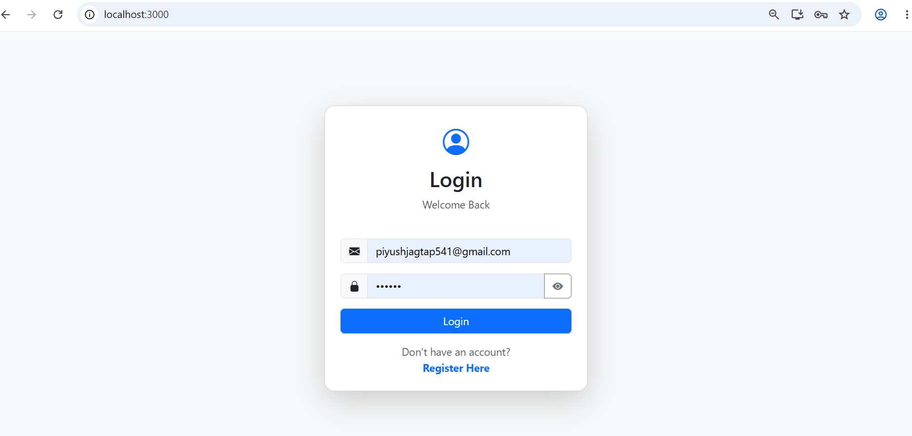
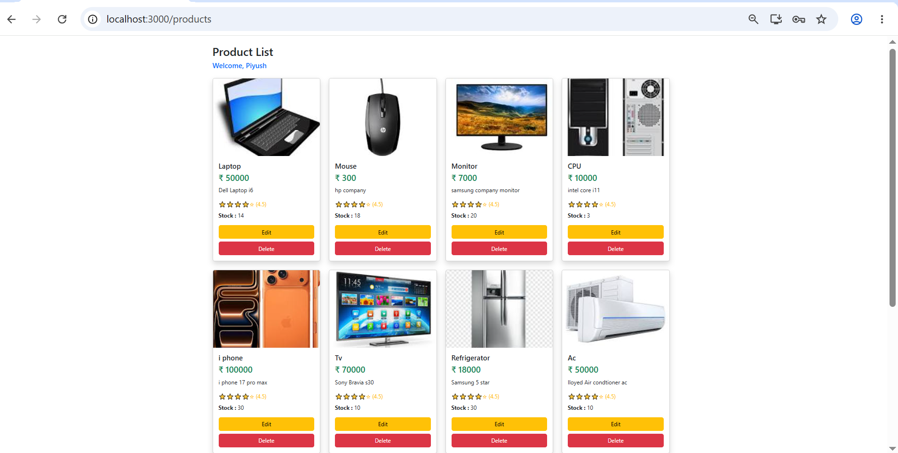
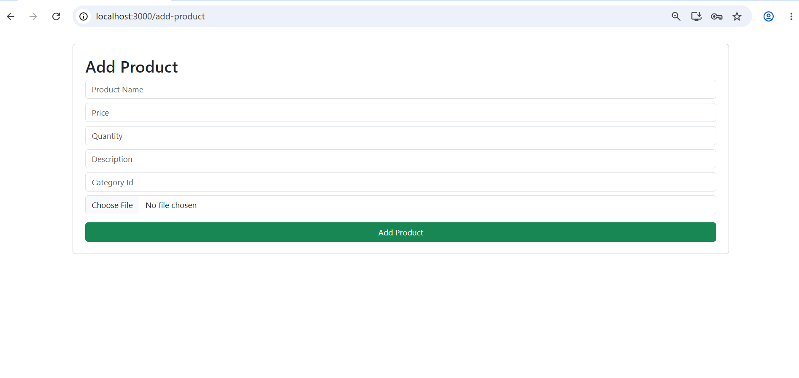
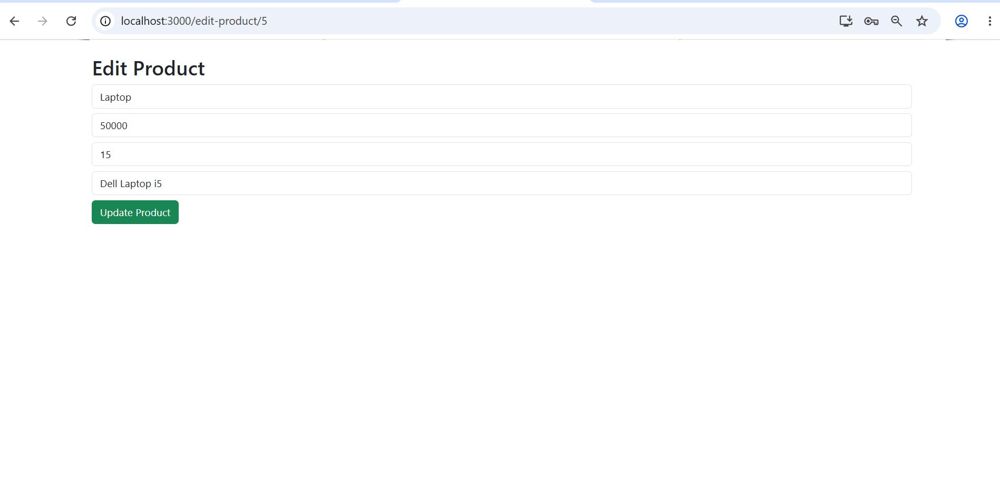
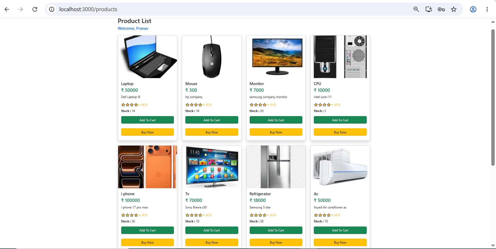
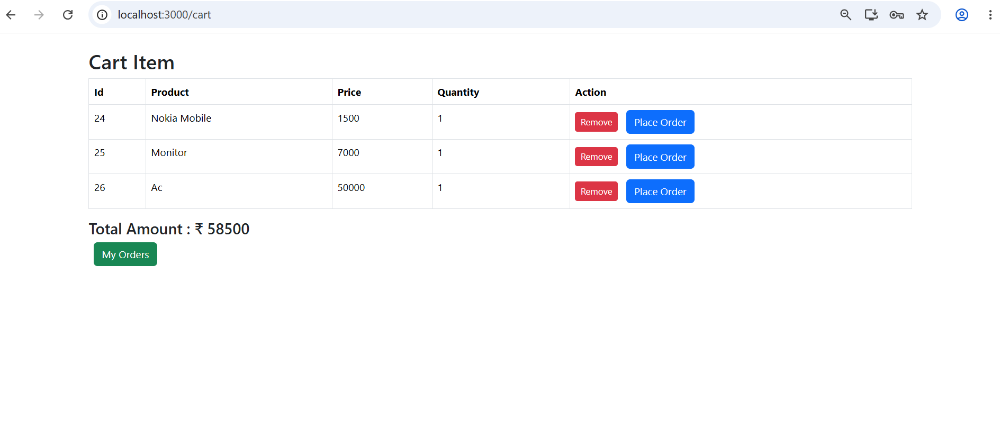
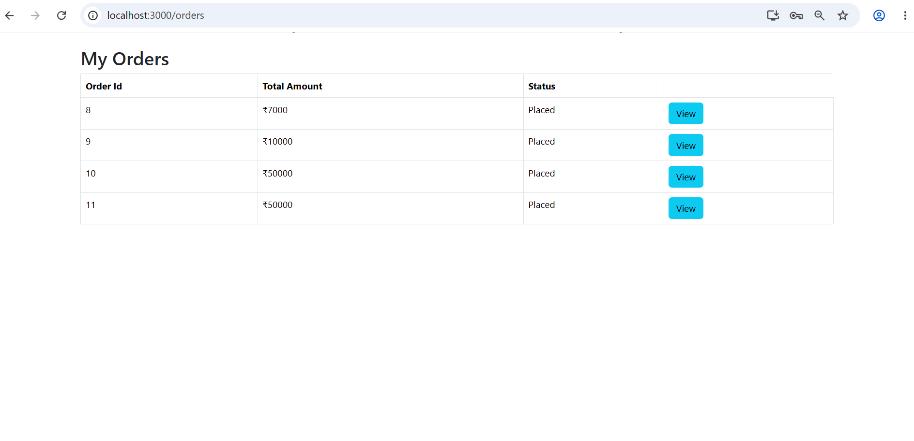
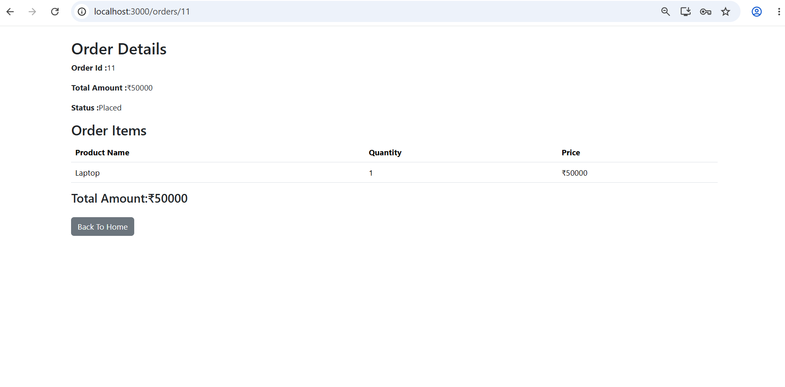

# E-Commerce Management System

A full-stack E-Commerce Management System built using Spring Boot, React.js, MySQL, JWT Authentication, and Role-Based Access Control (RBAC). The application provides secure authentication, product management, cart functionality, and order management for both Admin and User roles.

---

## Features

### Authentication & Security

- User Registration and Login
- JWT Token-Based Authentication
- Spring Security Integration
- Role-Based Access Control (ADMIN / USER)
- Protected API Endpoints

### Admin Features

- View All Products
- Add New Products
- Update Existing Products
- Delete Products
- Manage Product Catalog

### User Features

- Browse Products
- Add Products to Cart
- View Cart Items
- Place Orders
- View Order History
- View Order Details

---

## Tech Stack

### Backend

- Java
- Spring Boot
- Spring Security
- JWT Authentication
- Spring Data JPA
- Hibernate
- MySQL

### Frontend

- React.js
- React Router
- Axios
- Bootstrap

### Tools & Platforms

- Git
- GitHub
- Postman
- VS Code
- Eclipse/STS

---
## Database Tables

- User - Stores user account details, authentication data, and roles (ADMIN/USER)
- Product - Stores product information such as name, description, price, and stock
- Category - Stores product categories for better organization
- Cart - Stores products added to a user's shopping cart
- Order - Stores order details placed by users
- OrderItem - Stores individual products associated with each order

---
## Project Structure

E-Commerce-Management-System

│

├── backend

├── frontend

├── screenshots

└── README.md

---

## Screenshots

### Login page

### Admin Module

### Product List

### Add Product

### Update Product

---

### User Module

### Product List

### Cart

### My Orders

### Order Details View

---

## Installation & Setup

### Backend Setup

cd backend
mvn spring-boot:run

Backend will start on:

http://localhost:8080

### Frontend Setup

cd frontend
npm install
npm start

Frontend will start on:

http://localhost:3000

---

## Author

Piyush Jagtap

Java Full Stack Developer

